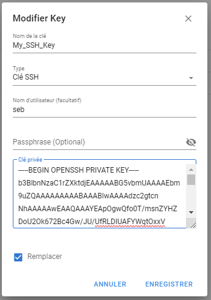

# SemaphoreQuilibrium
Install Semaphore WebUI to manage your Ansible Quilibrium Playbook

## Install Docker

```
# Add Docker's official GPG key:
sudo apt-get update
sudo apt-get install ca-certificates curl
sudo install -m 0755 -d /etc/apt/keyrings
sudo curl -fsSL https://download.docker.com/linux/ubuntu/gpg -o /etc/apt/keyrings/docker.asc
sudo chmod a+r /etc/apt/keyrings/docker.asc

# Add the repository to Apt sources:
echo \
  "deb [arch=$(dpkg --print-architecture) signed-by=/etc/apt/keyrings/docker.asc] https://download.docker.com/linux/ubuntu \
  $(. /etc/os-release && echo "$VERSION_CODENAME") stable" | \
  sudo tee /etc/apt/sources.list.d/docker.list > /dev/null
sudo apt-get update

sudo apt-get install docker-ce docker-ce-cli containerd.io docker-buildx-plugin docker-compose-plugin
```

## Generate Encryption Key

In your terminal, type this command and copy the result in a textfile.
```
head -c32 /dev/urandom | base64
```


## Install Semaphore

Go to Semaphore Website: https://www.semui.co/install/docker

Change this info:


That's all, now copy the generate docker command and paste in your termanial.


## Configure Semaphore

* Navigate to http://ip:port
* Login with login/password you previously set.

It will ask you to create a new project, Fill the project name you want, and click create.

  


* Now you will Add 3 keys:

* First choose SSH Key ( to connect to node via SSH)

    
  
    

* 2nd Login pass key (for sudo on host)

    

    

* 3nd : None Key
    
  
